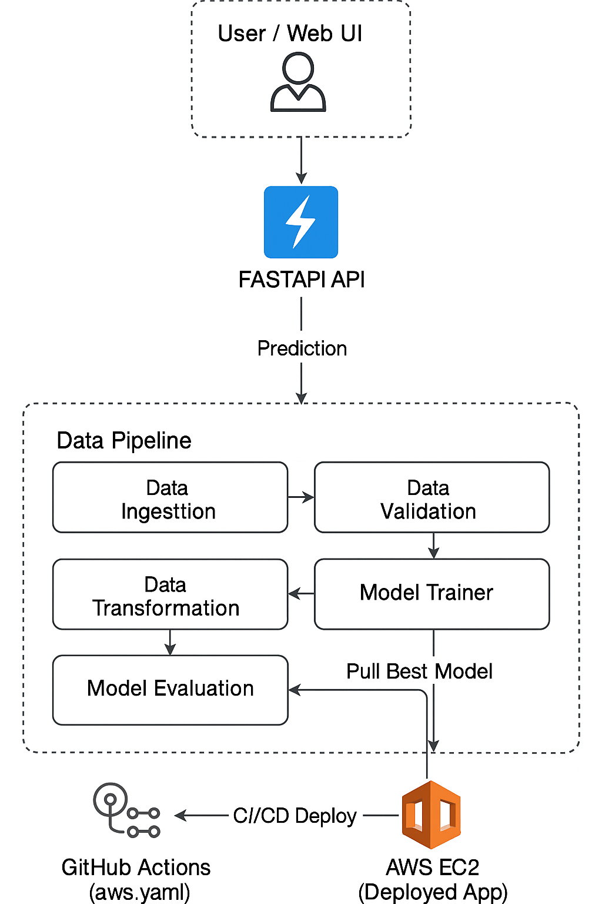

# Vehicle Insurance Data Pipeline – MLOps Project  
End-to-End Machine Learning System | AWS | MongoDB | CI/CD | Docker | GitHub Actions

## Overview  
This is a production-ready **MLOps pipeline for Vehicle Insurance Prediction**, showcasing an end-to-end automated system — from data ingestion to cloud deployment.  
The project integrates **MongoDB, AWS Cloud, CI/CD, GitHub Actions, Docker, model registry, and a fully-containerized API service**.

It demonstrates real-world skills in **ML engineering, MLOps orchestration, cloud-native workflows, and automated deployments**.

---

## Key Features  

### Full MLOps Pipeline (Modular & Scalable)
- **Data Ingestion** from MongoDB Atlas  
- **Data Validation** using YAML schema  
- **Data Transformation** (encoding, scaling, SMOTE-ENN)  
- **Model Training** with RandomForest  
- **Model Evaluation** (production vs new model using F1-score)  
- **Model Pusher** (deploys best model to AWS S3 model registry)  

### Cloud-Native Architecture
- MongoDB Atlas for remote dataset storage  
- AWS S3 for model registry  
- AWS ECR for container image storage  
- AWS EC2 for deployment + self-hosted GitHub runner  

### Containerized Application
- **Dockerfile** built for the complete FastAPI application  
- Container exposes ML inference endpoint + HTML UI  
- Deployed via GitHub Actions → AWS EC2  

### Automated CI/CD Pipeline (aws.yaml)
- Builds Docker image  
- Pushes to ECR  
- Triggers EC2 self-hosted runner  
- Pulls latest image & redeploys container  

---

## Project Architecture (PNG Diagram)



---

## Project Structure  
```
src/
 ├── components/
 │     ├── data_ingestion.py
 │     ├── data_validation.py
 │     ├── data_transformation.py
 │     ├── model_trainer.py
 │     ├── model_evaluation.py
 │     └── model_pusher.py
 ├── configuration/
 ├── cloud_storage/
 ├── utils/
 ├── templates/
 ├── static/
 ├── app.py
 ├── Dockerfile
 └── .github/workflows/aws.yaml
```

---

## Project Summary  
This project demonstrates a fully automated **end‑to‑end MLOps pipeline** for vehicle insurance prediction.  
Data is sourced from MongoDB, validated, transformed, and used for training ML models. The best-performing model is pushed to AWS S3, containerized using Docker, and deployed to AWS EC2 via GitHub Actions CI/CD.

It highlights strong practical experience in **MLOps, cloud deployment, data pipelines, Dockerization, and DevOps automation**.

---


